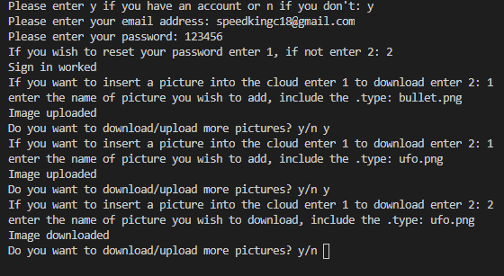
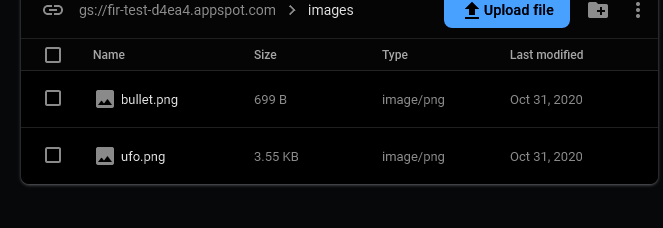
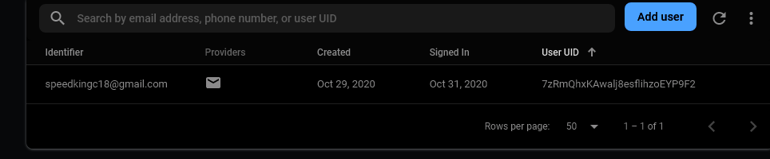

# Summery

This program connect you to a firebase that has you make a account. Then you can upload or download pictures from the cloud.

## Development enviroment

* Python 3.8.5
* Visual sudio code
* Pyrebase 3.0.27

## Exicution

* to exicute the program `Python fire.py`
 
 
 

## Useful websites

* [Googles firebase guide](https://firebase.google.com/docs/reference/admin/python)
* [Pyrebase tutorial](https://blog.upperlinecode.com/flask-and-firebase-and-pyrebase-oh-my-f30548d68ea9)
